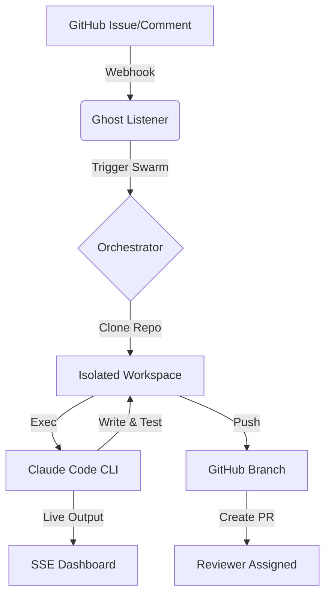

# 👻 Ghost Developer


> **The autonomous, zero-touch AI engineer.**  
> *While you sleep, the Ghost is working. Turn your GitHub issues into Pull Requests, automatically.*

Ghost Developer is an event-driven AI coding swarm built on the official **Claude Code CLI**. It doesn't just suggest code— it lives in your repository, runs its own tests, fixes its own bugs, and submits finalized Pull Requests directly to your team.

---

## 🌟 Key Features

- **🚀 The Omni-Agent Engine:** Leverages Claude Code's native agentic binary. It handles repository traversal, complex refactors, and terminal-based testing with 100% autonomy.
- **📺 Live Thought-Streaming Dashboard:** A premium Web UI that streams the agent's internal reasoning, tool-calls, and terminal outputs in real-time via SSE.
- **💎 Micro-Cost Architecture:** Designed for production scale. By utilizing **Claude 3.5 Haiku** and forced prompt caching, high-end engineering tasks cost as little as **$0.01**.
- **🛡️ Secure Sandboxing:** Each task is executed in an isolated workspace with automated branch management and review assignments.

---

## 📊 How it Works



---

## 🛠️ Quick Start

### 1. Prerequisites
Ensure the official **Claude Code CLI** is installed:
```bash
npm install -g @anthropic-ai/claude-code
```

### 2. Setup
```bash
git clone https://github.com/sachinlgg/ghost_developer.git
cd Ghost-Developer
pip install -r requirements.txt
cp .env.example .env
```

### 3. Run
Launch the listener:
```bash
python3 ghost_dev.py
```
Visit `http://localhost:8765` to watch the Ghost in action.

---

## ☁️ Deployment

Ghost Developer is **Docker-ready**. You can deploy it to **Railway**, **Render**, or **AWS** in minutes.

> [!TIP]
> See the [Full Deployment Guide](deployment_guide.md) for step-by-step instructions on setting up GitHub Webhooks and cloud hosting.

---

## 🧠 The Architecture

Ghost Developer bypasses conventional "Python-chain" limits by driving the compiled Claude Code binary. This allows the agent to:
1. **Self-Correct**: If a test fails, the agent reads the error and fixes it automatically.
2. **Bash Mastery**: It can run any terminal command necessary to build or validate the project.
3. **Contextual Awareness**: It uses native `grep` and `ls` logic to understand massive codebases without blowing the token window.

---

## 🗺️ Roadmap
- [ ] **Multi-Agent Swarms**: Orchestrating multiple Ghost instances for parallel feature development.
- [ ] **Slack/Discord Integration**: Get live updates in your team's chat.
- [ ] **Custom System Prompts**: Tailor the Ghost's coding style to your organization.

---

## 🛡️ License
MIT License - feel free to use, modify, and distribute.
